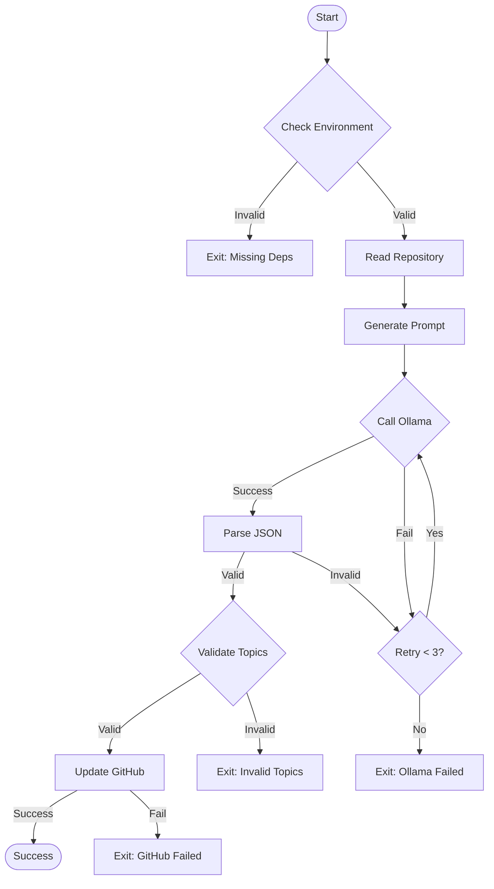
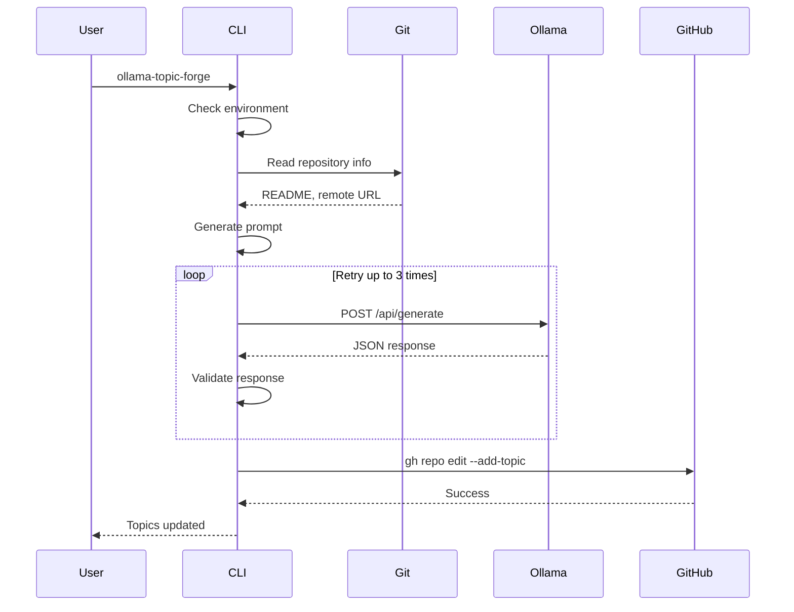

# Getting Started - Developer Guide

This guide helps developers understand the architecture, data flow, and contracts in ollama-topic-forge.

## Architecture Overview

```
┌─────────────┐     ┌─────────────┐     ┌─────────────┐
│    User     │────▶│   CLI Tool  │────▶│    Git      │
└─────────────┘     └──────┬──────┘     └─────────────┘
                           │
                    ┌──────▼──────┐
                    │  Validator  │
                    └──────┬──────┘
                           │
        ┌──────────────────┼──────────────────┐
        ▼                  ▼                  ▼
┌─────────────┐    ┌─────────────┐    ┌─────────────┐
│   Ollama    │    │   GitHub    │    │    JSON     │
│   Server    │    │     API     │    │   Parser    │
└─────────────┘    └─────────────┘    └─────────────┘
```

## Data Contracts

### 1. Environment Contract

The tool expects this environment:

```javascript
{
  "git": {
    "repository": true,
    "remote": "github.com/*",
    "clean": true
  },
  "ollama": {
    "server": "http://localhost:11434",
    "models": ["llama3.2:3b"],
    "running": true
  },
  "tools": {
    "jq": ">=1.6",
    "gh": ">=2.0",
    "guile": ">=3.0"
  }
}
```

### 2. Ollama Request Contract

```javascript
{
  "model": "llama3.2:3b",
  "prompt": "string",
  "format": "json",
  "system": "You are a GitHub topic generator...",
  "stream": false,
  "options": {
    "temperature": 0.7,
    "num_predict": 200
  }
}
```

### 3. Ollama Response Contract

```javascript
{
  "model": "llama3.2:3b",
  "created_at": "2025-07-27T10:00:00Z",
  "done": true,
  "response": "{\"topics\": [\"scheme\", \"llm\", \"github\"]}"
}
```

### 4. GitHub Topics Contract

```javascript
{
  "topics": [
    "valid-topic-name",  // 1-50 chars
    "another-topic"      // lowercase, alphanumeric + hyphens
  ]
}
```

## Control Flow



## State Machine

```
┌──────┐ check  ┌──────────┐ read  ┌─────────┐
│ INIT │──────▶│ ENV_CHECK │─────▶│ READING │
└──────┘        └──────────┘       └────┬────┘
                                        │ generate
                                        ▼
┌──────┐ update ┌────────────┐ valid ┌──────────┐
│ DONE │◀───────│ VALIDATING │◀──────│ QUERYING │
└──────┘        └────────────┘       └────┬─────┘
                                          │ retry
                    ┌──────┐              │
                    │ FAIL │◀─────────────┘
                    └──────┘        max retries
```

## Sequence Diagram



## Key Components

### 1. Main Entry Point (`src/ollama-topic-forge`)

```scheme
(define (main args)
  (validate-environment)    ; Check all deps
  (let* ((repo-data (read-repository))
         (topics (generate-topics repo-data)))
    (update-github-topics topics)))
```

### 2. Validation Layer (`specs/contracts/`)

- JSON schemas for API contracts
- TLA+ specs for workflow properties
- Property-based tests

### 3. Error Handling

```scheme
(define (with-retry max-attempts thunk)
  (let loop ((attempts 0))
    (guard (e (else 
               (if (< attempts max-attempts)
                   (begin
                     (sleep (backoff-delay attempts))
                     (loop (+ attempts 1)))
                   (raise e))))
      (thunk))))
```

## Running Experiments

Each experiment demonstrates a specific aspect:

```bash
# See all experiments
ls experiments/

# Run specific experiment
gmake -C experiments/001-ollama-structured-output test

# Run all experiments
gmake experiments-all
```

## Debugging

### Enable Debug Mode

```bash
export DEBUG=1
./ollama-topic-forge --verbose
```

### Common Issues

1. **Ollama not running**
   ```bash
   ollama serve  # Start server
   gmake verify-ollama  # Check status
   ```

2. **Invalid JSON from LLM**
   - Check prompt in debug output
   - Try different model
   - Increase temperature

3. **GitHub authentication**
   ```bash
   gh auth status
   gh auth login
   ```

## Testing Your Changes

1. **Unit Tests**
   ```bash
   gmake test
   ```

2. **Integration Test**
   ```bash
   gmake run  # Dry run mode
   ```

3. **Experiment**
   ```bash
   mkdir experiments/NNN-your-test
   # Add your experimental code
   ```

## Best Practices

1. **Always validate inputs** - See validation examples
2. **Use structured prompts** - Better LLM responses
3. **Handle errors gracefully** - User-friendly messages
4. **Test with different models** - Ensure compatibility
5. **Document your experiments** - Others learn from failures

## Further Reading

- [Experimental Engineering RFC](docs/development/rfc-experimental-engineering.md)
- [System Contracts](specs/contracts/system-contracts.md)
- [Property Tests](specs/contracts/property-tests.md)
- Individual experiments in `experiments/`

## Quick Reference

```bash
# Check setup
gmake deps

# Build and test
gmake all

# Run experiments
gmake experiments-all

# Validate specific components
./scripts/validate-all.sh

# Debug mode
DEBUG=1 ./build/ollama-topic-forge --dry-run
```

Welcome to ollama-topic-forge development!