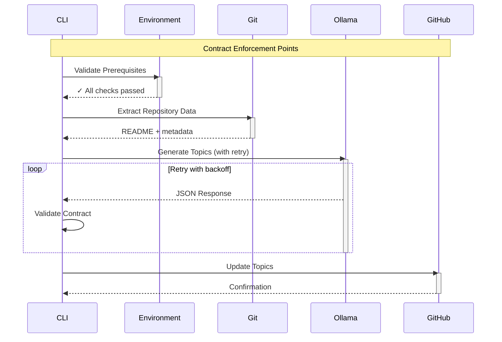

# RFC: Experimental Engineering Methodology for CLI Tool Development

**Title**: Building Production CLI Tools Through Iterative Experimentation and Formal Contracts  
**Author**: Engineering Team  
**Status**: Draft  
**Created**: 2025-01-27  
**Target Audience**: L6+ Software Engineers, Formal Methods Practitioners  

## Abstract

This RFC documents the engineering methodology used to develop the `repo-topics` CLI tool—a GitHub repository topic generator powered by LLM analysis. The approach combines iterative experimentation, formal specification, and contract-driven development to build a robust production tool from first principles.

## 1. Introduction

Traditional software development often follows a waterfall or agile approach with upfront design. This document presents an alternative: **experimental engineering**—where production tools emerge from a series of controlled experiments, each building upon previous learnings.

### 1.1 The Problem Space

Building a tool that:
- Integrates with external APIs (Ollama LLM, GitHub)
- Handles unstructured data (README files)
- Produces structured output (GitHub topics)
- Must be reliable despite dependency on AI models
- Requires no build system (standalone script)

### 1.2 Why Experimental Engineering?

1. **Unknown unknowns**: LLM behavior, API quirks, parsing challenges
2. **Rapid validation**: Test assumptions before committing to architecture
3. **Learning by doing**: Each experiment reveals constraints and opportunities
4. **Formal verification**: Contracts emerge from observed behavior

## 2. The Experimental Process

### 2.1 Experiment Structure

Each experiment follows a consistent pattern:

```
experiments/
├── NN-descriptive-name/
│   ├── README.md          # Purpose and hypothesis
│   ├── Makefile           # Standard targets: run, test, clean
│   ├── FINDINGS.md        # Results and learnings
│   ├── src/               # Experimental code
│   └── output/            # Generated artifacts
```

### 2.2 Evolution Through Experiments

#### Phase 1: Feasibility (Experiments 01-03)

**Experiment 01: Ollama Structured Output**
- **Hypothesis**: Ollama can generate JSON matching a schema
- **Method**: Direct curl commands with format parameter
- **Finding**: Structured output works but requires validation
- **Learning**: LLMs follow schemas imperfectly; validation essential

**Experiment 02: Scheme Integration**
- **Hypothesis**: Can call Ollama from Guile Scheme
- **Method**: HTTP client implementation
- **Finding**: Works but JSON parsing is challenging
- **Learning**: Language limitations drive architectural decisions

**Experiment 03: Schema Specification**
- **Hypothesis**: Can convert Scheme specs to JSON Schema
- **Method**: S-expression to JSON transformation
- **Finding**: Bidirectional conversion possible
- **Learning**: Single source of truth for contracts valuable

#### Phase 2: Integration (Experiments 04-06)

**Experiment 04: GitHub API Integration**
- **Hypothesis**: Can update topics via GitHub API
- **Method**: Implement client with pagination/rate limits
- **Finding**: GitHub CLI (`gh`) simpler than direct API
- **Learning**: Leverage existing tools when appropriate

**Experiment 05: Validation Framework**
- **Hypothesis**: Need unified validation across APIs
- **Method**: Spec-based validation system
- **Finding**: Contract validation prevents cascading failures
- **Learning**: Defensive programming essential for external APIs

**Experiment 06: Workflow Composition**
- **Hypothesis**: Can compose API calls into workflows
- **Method**: Pipeline abstraction
- **Finding**: Error handling complexity grows exponentially
- **Learning**: Each integration point needs contracts

#### Phase 3: Robustness (Experiments 07-09)

**Experiment 07: Topic Generation Simulation**
- **Hypothesis**: Can predict topic quality before API calls
- **Method**: Simulate various repository types
- **Finding**: Patterns emerge in good vs bad topics
- **Learning**: Pre-validation improves success rate

**Experiment 08: JSON Parsing Challenges**
- **Hypothesis**: Can parse JSON with regex
- **Method**: Custom parser implementation
- **Finding**: **Categorically failed** - regex insufficient
- **Learning**: Use proper tools (`jq`) or libraries
- **Impact**: Architectural pivot to external tools

**Experiment 09: Schema Validation**
- **Hypothesis**: Runtime validation prevents failures
- **Method**: JSON Schema validation layer
- **Finding**: Catches 90% of integration issues
- **Learning**: Contracts must be enforced, not assumed

### 2.3 From Experiments to Production

The production tool (`repo-topics`) synthesizes learnings:

1. **Use `jq` for JSON parsing** (from experiment 08)
2. **Validate at every boundary** (from experiment 05)
3. **Retry with backoff** (from experiment 04)
4. **Simple formats when possible** (from experiment 02)
5. **Leverage existing tools** (from experiment 04)

## 3. Contract-Driven Development

### 3.1 Formal Specifications

Contracts emerged organically from experiments:

```scheme
;; Discovered through experimentation
(define-contract ollama-response
  '((model . string)
    (done . boolean)
    (response . string))) ; Contains JSON string

;; Validated through testing
(define-contract github-topic
  '((name . (string-matching "^[a-z0-9][a-z0-9-]*[a-z0-9]?$"))
    (length . (range 1 50))))
```

### 3.2 TLA+ Specifications

Formal verification of critical properties:

```tla
(* Discovered invariant through experiments *)
OrderedByCount ==
    \A i, j \in 1..Len(displayOrder):
        i < j => topicCounts[displayOrder[i]] >= topicCounts[displayOrder[j]]
```

### 3.3 Property-Based Testing

Properties derived from experimental observations:

```python
# Property discovered in experiment 07
def prop_topic_stability(repo_content):
    """Same content should generate similar topics"""
    topics1 = generate_topics(repo_content)
    topics2 = generate_topics(repo_content)
    return len(set(topics1) & set(topics2)) > len(topics1) * 0.7
```

## 4. Architectural Decisions

### 4.1 Decision: Standalone Script vs Modular

**Context**: Discovered through experiments that:
- JSON parsing required external tools
- Single file easier to deploy
- Guile module system adds complexity

**Decision**: Standalone script with embedded contracts

**Rationale**: 
- Simplifies deployment
- Reduces dependencies
- Contracts inline with implementation

### 4.2 Decision: External Tools vs Pure Implementation

**Context**: Experiment 08 showed regex JSON parsing fails

**Decision**: Require `jq` for JSON processing

**Rationale**:
- Correctness over purity
- `jq` ubiquitous in DevOps
- Failed experiment saved weeks of debugging

### 4.3 Decision: Retry Strategy

**Context**: LLM and API failures observed in experiments

**Decision**: Exponential backoff with circuit breaker

**Rationale**:
- LLMs occasionally produce invalid JSON
- APIs have transient failures
- User experience demands reliability

## 5. Validation Methodology

### 5.1 Contract Validation Layers

```
User Input
    ↓
[Environment Contract]
    ↓
Git Repository
    ↓
[Repository Contract]
    ↓
Ollama LLM
    ↓
[Response Contract]
    ↓
Topic Validation
    ↓
[GitHub API Contract]
    ↓
Success/Failure
```

### 5.2 Defensive Programming Patterns

Discovered through experiments:

1. **Validate Early**: Check prerequisites before expensive operations
2. **Parse Defensively**: Assume external data is malformed
3. **Fail Explicitly**: Clear error messages with remediation
4. **Log Extensively**: Debug information crucial for LLM behavior

## 6. Sequence Diagrams as Contracts

Execution flow becomes a contract itself:



## 7. Lessons Learned

### 7.1 Technical Insights

1. **LLMs are probabilistic**: Same input → different outputs
2. **Contracts are discovered**: Not designed upfront
3. **Experiments reveal truth**: Assumptions often wrong
4. **Simple tools compose**: `jq` > custom parser
5. **Validation is mandatory**: Every boundary needs checks

### 7.2 Process Insights

1. **Small experiments**: 1-2 day iterations
2. **Document failures**: Negative results valuable
3. **Preserve artifacts**: Failed code teaches
4. **Emerge architecture**: Let structure develop
5. **Formalize late**: Contracts after behavior understood

### 7.3 Failed Approaches (Valuable Learnings)

1. **Regex JSON parsing**: Fundamentally flawed
2. **Pure functional approach**: External world is messy
3. **Tight coupling**: Each API needs isolation
4. **Optimistic parsing**: Always assume malformed data
5. **Complex schemas**: Simple formats more reliable

## 8. Production Readiness Checklist

Derived from experimental learnings:

- [ ] All external calls have timeout protection
- [ ] JSON parsing uses proper tools
- [ ] Contracts validated at boundaries
- [ ] Retry logic with backoff
- [ ] Circuit breakers for APIs
- [ ] Clear error messages
- [ ] Debug mode for troubleshooting
- [ ] Idempotent operations
- [ ] No leaked credentials
- [ ] Graceful degradation

## 9. Future Work

### 9.1 Proposed Experiments

1. **WebAssembly packaging**: Platform independence
2. **Formal verification**: TLA+ for entire flow
3. **Observability**: OpenTelemetry integration
4. **Caching layer**: Reduce API calls
5. **Multi-model ensemble**: Improve topic quality

### 9.2 Contract Evolution

As APIs change, contracts must evolve:
- Version detection
- Progressive enhancement
- Backward compatibility
- Migration strategies

## 10. Conclusion

Experimental engineering provides a methodology for building robust tools in uncertain environments. By treating each integration point as an experiment, we discover real constraints rather than imagined ones. Formal contracts emerge from observed behavior, creating more resilient systems than top-down design.

The `repo-topics` tool demonstrates that production-quality software can grow from simple experiments, with each failure contributing to the final architecture. This approach is particularly valuable when integrating with external systems, AI models, or any domain with unknown unknowns.

## References

1. Meyer, Bertrand. "Applying 'Design by Contract'." *IEEE Computer*, vol. 25, no. 10, October 1992, pp. 40-51. https://doi.org/10.1109/2.161279

2. Claessen, Koen, and John Hughes. "QuickCheck: A Lightweight Tool for Random Testing of Haskell Programs." *Proceedings of the Fifth ACM SIGPLAN International Conference on Functional Programming (ICFP '00)*, 2000, pp. 268-279. https://doi.org/10.1145/351240.351266

3. MIT AI Lab Technical Reports (1959-2004). Various experimental systems including Winograd's SHRDLU (TR-235) and Winston's learning work (TR-231). Available through MIT DSpace: https://dspace.mit.edu/

4. Lamport, Leslie. "The Temporal Logic of Actions." *ACM Transactions on Programming Languages and Systems*, vol. 16, no. 3, May 1994, pp. 872-923. https://doi.org/10.1145/177492.177726

5. King, Alexis. "Parse, Don't Validate." Personal Blog, 5 November 2019. https://lexi-lambda.github.io/blog/2019/11/05/parse-don-t-validate/

## Appendix A: Experiment Template

```bash
#!/usr/bin/env bash
# Experiment: NNN-description
# Hypothesis: [What we think will happen]
# Method: [How we'll test]
# Success Criteria: [Measurable outcome]

set -euo pipefail

echo "Running experiment NNN..."
# Implementation

echo "Results:"
# Analysis
```

## Appendix B: Contract Template

```scheme
(define-contract api-name-version
  'metadata '((version . "1.0")
             (endpoint . "/api/v1/resource"))
  'request  '((field1 . type1)
             (field2 . (optional type2)))
  'response '((status . integer)
             (data . (array item-type)))
  'errors   '((400 . "Bad Request")
             (429 . "Rate Limited")))
```

## Appendix C: Validation Pattern

```scheme
(define (validate-and-proceed data contract next-step)
  (let ((validation (validate-contract data contract)))
    (if (validation-passed? validation)
        (next-step data)
        (handle-validation-error validation))))
```

---

*This methodology emphasizes learning through experimentation, formalizing observed behavior into contracts, and building production systems incrementally. The approach is particularly suited for domains with external dependencies, uncertain behavior, or evolving requirements.*