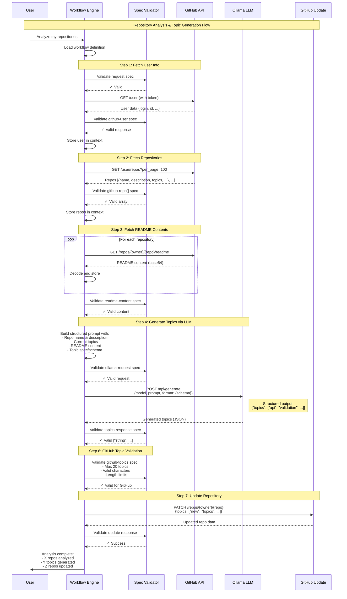

# GitHub → Ollama Topic Generation Flow

## Sequence Diagram



## Key Spec Domains & Validation Points

### 1. GitHub Request/Response Specs
```scheme
;; User spec
(register-spec 'github-user
  '((login . string)
    (id . integer)
    (type . (enum "User" "Organization"))))

;; Repository spec  
(register-spec 'github-repo
  '((name . string)
    (description . (optional string))
    (topics . (array string 0 20))  ; GitHub limit
    (visibility . (enum "public" "private"))))

;; README spec
(register-spec 'github-readme
  '((content . string)  ; base64 encoded
    (encoding . (enum "base64"))
    (size . integer)))

;; Topic update spec
(register-spec 'github-topic-update
  '((topics . (array (string-pattern "^[a-z0-9][a-z0-9-]*$") 0 20))))
```

### 2. Ollama Request/Response Specs
```scheme
;; Ollama request spec
(register-spec 'ollama-topic-request
  '((model . string)
    (prompt . string)
    (format . (object
               (type . "object")
               (properties . (object
                             (topics . (object
                                       (type . "array")
                                       (items . (object
                                                (type . "string")))
                                       (maxItems . 10)))))))
    (stream . boolean)))

;; Ollama response spec
(register-spec 'ollama-topic-response
  '((model . string)
    (response . string)  ; JSON string
    (done . boolean)))

;; Parsed topics spec
(register-spec 'generated-topics
  '((topics . (array string 1 10))))
```

### 3. Workflow Steps with Validation

```scheme
(define github-topic-workflow
  (create-workflow "github-topic-generation" 
    "Analyze repos and generate topics"
    
    ;; Fetch user
    (create-step 'fetch-user 'github-api
                 '((endpoint . "/user")))
    
    ;; Validate user response
    (create-step 'validate-user 'validate
                 '((input . fetch-user)
                   (spec . github-user))
                 'fetch-user)
    
    ;; Fetch repos
    (create-step 'fetch-repos 'github-api
                 '((endpoint . "/user/repos")
                   (params . ((per_page . 100)))))
    
    ;; Validate repos
    (create-step 'validate-repos 'validate
                 '((input . fetch-repos)
                   (spec . (array github-repo)))
                 'fetch-repos)
    
    ;; Fetch READMEs (parallel)
    (create-step 'fetch-readmes 'parallel-api
                 '((repos . validate-repos)
                   (endpoint-template . "/repos/{owner}/{name}/readme"))
                 'validate-repos)
    
    ;; Generate topics for each repo
    (create-step 'generate-topics 'ollama-structured
                 '((repos . validate-repos)
                   (readmes . fetch-readmes)
                   (schema . generated-topics))
                 'validate-repos 'fetch-readmes)
    
    ;; Validate generated topics
    (create-step 'validate-topics 'validate
                 '((input . generate-topics)
                   (spec . github-topic-update))
                 'generate-topics)
    
    ;; Update repos
    (create-step 'update-repos 'github-batch-update
                 '((repos . validate-repos)
                   (topics . validate-topics))
                 'validate-repos 'validate-topics)))
```

## Benefits of Spec-Driven Approach

1. **Type Safety**: Validate at boundaries between systems
2. **Clear Contracts**: Each API has defined input/output
3. **Error Prevention**: Catch issues before API calls
4. **Documentation**: Specs serve as documentation
5. **Testing**: Generate test data from specs
6. **Evolution**: Version specs as APIs change