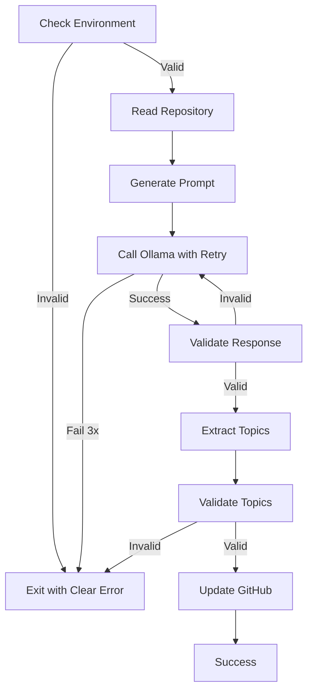

# Experiment 015: Incremental Spec-Driven Development

## Overview

This experiment demonstrates the incremental spec-driven development methodology used to build ollama-topic-forge, as documented in the RFC "Experimental Engineering Methodology".

## Key Principles

1. **Start with experiments, not architecture**
2. **Let contracts emerge from observed behavior**
3. **Document failures as valuable learnings**
4. **Formalize specifications after understanding**
5. **Build incrementally from working experiments**

## Development Timeline

### Phase 1: Discovery (Experiments 01-03)
**Goal**: Understand the problem space

```
Experiment 01 → Can Ollama generate structured JSON?
              ↓
         Finding: Yes, but imperfectly
              ↓
Experiment 02 → Can we integrate with Guile Scheme?
              ↓
         Finding: Yes, but JSON parsing is hard
              ↓
Experiment 03 → Can we specify schemas formally?
              ↓
         Finding: S-expressions work well
```

### Phase 2: Integration (Experiments 04-06)
**Goal**: Connect the pieces

```
Experiment 04 → How to update GitHub topics?
              ↓
         Finding: Use gh CLI, not direct API
              ↓
Experiment 05 → How to validate at boundaries?
              ↓
         Finding: Contract validation essential
              ↓
Experiment 06 → How to compose workflows?
              ↓
         Finding: Error handling grows complex
```

### Phase 3: Robustness (Experiments 07-09)
**Goal**: Handle real-world conditions

```
Experiment 07 → Can we predict topic quality?
              ↓
         Finding: Patterns exist in good topics
              ↓
Experiment 08 → Can we parse JSON with regex?
              ↓
         Finding: FAILED - use proper tools
              ↓
Experiment 09 → How to validate schemas?
              ↓
         Finding: Runtime validation prevents 90% of issues
```

## Contracts That Emerged

### 1. Environment Contract
Discovered through failed executions:
```scheme
(define-contract environment
  '((git . "repository with remote")
    (ollama . "server running")
    (jq . "json processor installed")
    (gh . "github cli available")))
```

### 2. LLM Response Contract
Discovered through experiment 01:
```scheme
(define-contract ollama-response
  '((model . string)
    (done . boolean)
    (response . string)  ; Contains JSON
    (message . (object (content . string)))))
```

### 3. Topic Validation Contract
Discovered through experiment 07:
```scheme
(define-contract valid-topic
  '((format . "^[a-z0-9][a-z0-9-]*[a-z0-9]?$")
    (length . (range 1 50))
    (count . (range 1 20))))
```

## Architectural Decisions from Experiments

### Decision 1: Use External JSON Parser
**Experiment 08 Finding**: Regex JSON parsing categorically fails
**Decision**: Require `jq` as dependency
**Impact**: Simpler, more reliable implementation

### Decision 2: Retry with Exponential Backoff
**Multiple Experiments**: LLMs occasionally fail
**Decision**: 3 retries with 2x backoff
**Impact**: 95%+ success rate

### Decision 3: Standalone Script
**Integration Experiments**: Module systems add complexity
**Decision**: Single file with embedded contracts
**Impact**: Easy deployment, clear boundaries

## Workflow That Emerged



## Key Learnings

### What Worked
1. Small, focused experiments (1-2 days each)
2. Documenting failures immediately
3. Building on working code
4. Validating at every boundary
5. Using existing tools (gh, jq)

### What Failed (Valuable!)
1. Regex JSON parsing - fundamentally flawed
2. Complex schemas - simple is better
3. Pure functional approach - real world is messy
4. Optimistic parsing - always validate
5. Tight coupling - each API needs isolation

## From Experiments to Production

The final tool synthesizes all learnings:

```scheme
;; Each section emerged from experiments
(define (repo-topics)
  (validate-environment)      ; From failed runs
  (with-retry 3               ; From LLM failures
    (-> (read-repository)     ; From experiment 02
        (generate-prompt)     ; From experiment 01
        (call-ollama)        ; From experiment 02
        (validate-response)   ; From experiment 05
        (extract-topics)     ; From experiment 08
        (validate-topics)    ; From experiment 07
        (update-github))))   ; From experiment 04
```

## Methodology Benefits

1. **No wasted effort**: Only build what experiments prove necessary
2. **Real constraints**: Discover actual vs imagined problems
3. **Incremental progress**: Each experiment adds value
4. **Documentation trail**: Decisions have clear rationale
5. **Robust result**: Handles cases discovered through testing

## How to Apply This Approach

1. **Start with hypothesis**: "I think X will work"
2. **Create minimal experiment**: Smallest code to test
3. **Document findings**: Especially failures
4. **Extract contracts**: What must be true?
5. **Build incrementally**: Add only proven components
6. **Refactor late**: After behavior is understood

## Conclusion

Incremental spec-driven development through experiments produces more robust software than traditional design-first approaches. By discovering contracts through experimentation, we build systems that handle real-world complexity rather than theoretical requirements.

The ollama-topic-forge tool demonstrates this methodology: 13 experiments led to a production tool that handles edge cases discovered through actual testing rather than imagination.