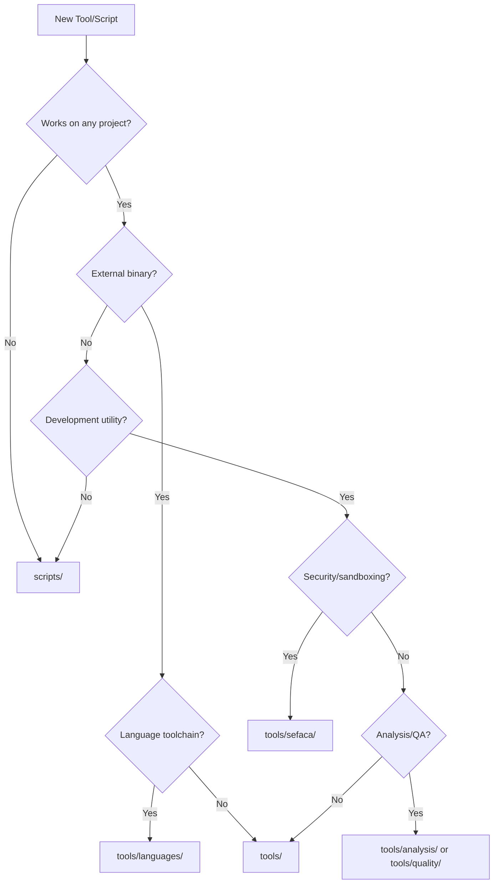

# Experiment 023: Tools Taxonomy - Define the Scope of tools/

## Goal

Establish clear guidelines for what belongs in `tools/` vs `scripts/` vs other directories in software projects.

## Research Questions

- What makes a tool "general purpose" enough for tools/?
- Should tools be self-contained or can they have dependencies?
- How do we handle tool versioning?
- Should project-specific configurations of general tools go in tools/?

## Proposed Directory Structure

```
tools/
├── SEFACA*              # General sandboxing wrapper
├── SEFACA-make*         # Make-specific sandboxing
├── SEFACA-run*          # Generic command sandboxing
├── sefaca-report*       # Log analysis tool
├── tla/                 # External tool (TLA+)
│   └── tla2tools.jar
├── lean4/               # External tool (Lean 4)
│   └── bin/
├── formatters/          # Code formatters
│   ├── guile-fmt*
│   └── scmfmt*
└── analyzers/           # Static analysis
    └── guile-lint*

scripts/
├── setup-dev.sh         # Project-specific dev setup
├── run-benchmarks.sh    # Project-specific benchmarks
└── deploy-prod.sh       # Project-specific deployment
```

## Decision Matrix

| Criteria | tools/ | scripts/ |
|----------|--------|----------|
| Works on any project | ✓ | ✗ |
| Project-specific logic | ✗ | ✓ |
| External binaries | ✓ | ✗ |
| Could be packaged separately | ✓ | ✗ |
| Modifies project files | ? | ✓ |
| Reusable across repositories | ✓ | ✗ |
| Requires configuration | ✓ (minimal) | ✓ (extensive) |
| Has own version lifecycle | ✓ | ✗ |

## Tool Categories

### Category 1: Infrastructure Tools
**Location**: `tools/`
**Examples**: SEFACA sandboxing, TLA+ model checker, LEAN4 prover
**Characteristics**:
- Generic, reusable across projects
- Often wrapping external tools
- Minimal project-specific configuration
- Could be distributed separately

### Category 2: Project Scripts
**Location**: `scripts/`
**Examples**: `setup-dev.sh`, `deploy-prod.sh`, `run-benchmarks.sh`
**Characteristics**:
- Specific to this project's workflow
- Contains business/project logic
- Heavy configuration and assumptions
- Not useful outside this project

### Category 3: Development Utilities
**Location**: `tools/` or `scripts/` (depends on reusability)
**Examples**: Code formatters, linters, generators
**Decision Criteria**:
- If configurable for any project → `tools/`
- If hardcoded for this project → `scripts/`

## Taxonomy Rules

### tools/ Directory Rules
1. **Reusability**: Could be useful in other projects
2. **Self-containment**: Minimal external dependencies
3. **Configuration**: Uses environment vars or config files, not hardcoded paths
4. **Documentation**: Standalone documentation explaining usage
5. **Versioning**: Independent version lifecycle from main project

### scripts/ Directory Rules
1. **Project-specific**: Assumes knowledge of this project's structure
2. **Integration**: Tightly coupled with project build system
3. **Convenience**: Automates common project tasks
4. **Hardcoded**: May contain project-specific paths and assumptions

## Examples

### Good tools/ Candidates
```bash
# tools/format-scheme - Generic Scheme formatter
#!/bin/bash
# Works on any Scheme project
find "${1:-.}" -name "*.scm" -exec guile-fmt {} \;

# tools/SEFACA - Generic sandboxing
#!/bin/bash
# Can sandbox any command
sefaca_run "$@"
```

### Good scripts/ Candidates
```bash
# scripts/setup-dev.sh - Project-specific setup
#!/bin/bash
# Hardcoded to this project's needs
cp .env.example .env
make deps
ollama pull llama3.2:3b
gh auth login
```

## Testing Framework

Test each tool with this checklist:

1. **Portability Test**: Can it run in a fresh clone of another project?
2. **Dependency Test**: Does it fail gracefully when dependencies are missing?
3. **Configuration Test**: Can it be configured without editing the script?
4. **Documentation Test**: Can someone use it without reading the source?
5. **Independence Test**: Does it work without this project's specific setup?

## Implementation Plan

1. **Audit Current Tools**: Categorize existing utilities
2. **Create Taxonomy Guidelines**: Document the rules
3. **Implement Test Framework**: Automate the categorization tests
4. **Migrate Utilities**: Move tools to appropriate directories
5. **Update Documentation**: Reflect new organization

## Success Metrics

- Clear placement rules that 90% of team agrees on
- New utilities naturally go to correct location
- External projects can reuse tools/ utilities
- scripts/ directory remains project-specific
- Tool discovery and usage improves

## Edge Cases

### Configuration Files for Generic Tools
**Solution**: Create `tools/config/` for tool-specific configurations
```
tools/
├── tla-plus/
│   └── bin/tlc
└── config/
    ├── tla-plus.conf
    └── lean4.conf
```

### Project-Specific Tool Configurations
**Solution**: Use environment variables or config files
```bash
# Instead of hardcoding
tools/linter --rules=guile-specific

# Use configuration
LINTER_RULES_FILE=config/guile-lint.conf tools/linter
```

### Hybrid Tools
**Solution**: Create wrapper in scripts/ that calls tool in tools/
```bash
# scripts/project-lint.sh
#!/bin/bash
export LINTER_RULES_FILE="$PROJECT_ROOT/config/lint.conf"
tools/generic-linter "$@"
```

# Tools Directory Taxonomy

## Definition
The `tools/` directory contains **project-agnostic executables** that enhance development workflow but are not specific to the project's business logic.

## Inclusion Criteria

### ✅ What Belongs in tools/

1. **General-purpose development tools**
   - Build wrappers (SEFACA-make)
   - Execution sandboxes (SEFACA)
   - Code formatters (language-specific but project-agnostic)
   - Linters and analyzers

2. **External language toolchains**
   - Compilers/interpreters (tla+, lean4, custom versions)
   - Language servers
   - Package managers for languages

3. **Reusable utilities**
   - Log analyzers
   - Performance profilers
   - Testing frameworks
   - Documentation generators

4. **Infrastructure tools**
   - Container builders
   - Deployment helpers (generic)
   - Monitoring collectors

### ❌ What Does NOT Belong in tools/

1. **Project-specific scripts**
   - Database migrations for THIS project
   - Deployment scripts with hardcoded values
   - Business logic utilities

2. **Configuration files**
   - .env files
   - Project-specific configs
   - Credentials

3. **Generated artifacts**
   - Built binaries of the project
   - Compiled documentation
   - Test results

## Directory Structure Pattern

```
tools/
├── README.md                 # Tools documentation
├── install.sh               # Tool installation script
│
├── sefaca/                  # SEFACA tool family
│   ├── SEFACA*             # Base command wrapper
│   ├── SEFACA-make*        # Make wrapper
│   └── sefaca-report*      # Log analyzer
│
├── languages/               # Language-specific tools
│   ├── guile/
│   │   ├── guile-fmt*      # Formatter
│   │   └── guile-lint*     # Linter
│   ├── tla/
│   │   └── tla2tools.jar
│   └── lean4/
│       └── bin/
│
├── analysis/                # Code analysis tools
│   ├── complexity*         # Complexity analyzer
│   ├── coverage*           # Coverage reporter
│   └── profiler*           # Performance profiler
│
└── quality/                 # Quality assurance
    ├── pre-commit*         # Git hooks
    └── ci-local*           # Local CI runner
```

## Decision Tree



## Versioning Strategy

### For External Tools
```bash
tools/
└── languages/
    └── lean4/
        ├── v4.0.0/          # Specific version
        │   └── bin/
        └── current -> v4.0.0 # Symlink to active version
```

### For Custom Tools
Include version in the tool itself:
```bash
#!/bin/sh
# SEFACA v2.1.0
VERSION="2.1.0"
```

## Installation Management

### tools/install.sh
```bash
#!/bin/bash
# Install or update tools

# Install SEFACA family
install_sefaca() {
    echo "Installing SEFACA tools..."
    chmod +x tools/sefaca/*
}

# Download external tools
install_languages() {
    echo "Installing language tools..."
    
    # TLA+
    if [ ! -f tools/languages/tla/tla2tools.jar ]; then
        mkdir -p tools/languages/tla
        wget -O tools/languages/tla/tla2tools.jar \
            https://github.com/tlaplus/tlaplus/releases/download/v1.8.0/tla2tools.jar
    fi
    
    # Add other language installs
}

# Main
install_sefaca
install_languages
echo "Tools installation complete!"
```

## Integration with direnv

### .envrc additions
```bash
# Add all tool directories to PATH
export PATH="$PROJECT_ROOT/tools:$PATH"
export PATH="$PROJECT_ROOT/tools/sefaca:$PATH"
export PATH="$PROJECT_ROOT/tools/languages/guile:$PATH"

# Tool-specific environment
export TLA_HOME="$PROJECT_ROOT/tools/languages/tla"
export LEAN_PATH="$PROJECT_ROOT/tools/languages/lean4/current"
```

## Maintenance Guidelines

1. **Regular Updates**: Schedule quarterly tool updates
2. **Compatibility Testing**: Test tools with project before updating
3. **Documentation**: Each tool subdirectory should have a README
4. **Deprecation**: Mark tools as deprecated before removal
5. **Security**: Audit tools for vulnerabilities

## Examples

### Good Fit for tools/
- `cloc` - Line counter (works on any codebase)
- `jq` - JSON processor (general purpose)
- `shellcheck` - Shell script linter (language tool)
- `SEFACA-make` - Sandboxed make (build tool)

### Better in scripts/
- `deploy-to-prod.sh` - Has production URLs
- `setup-dev-db.sh` - Project-specific database
- `run-integration-tests.sh` - Tests this project
- `generate-client-report.sh` - Business logic

## Conclusion

This taxonomy provides clear guidelines for organizing development utilities while maintaining both reusability and project-specific convenience.