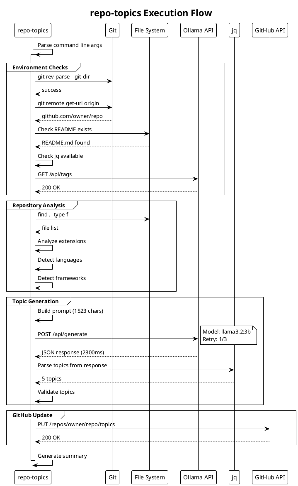
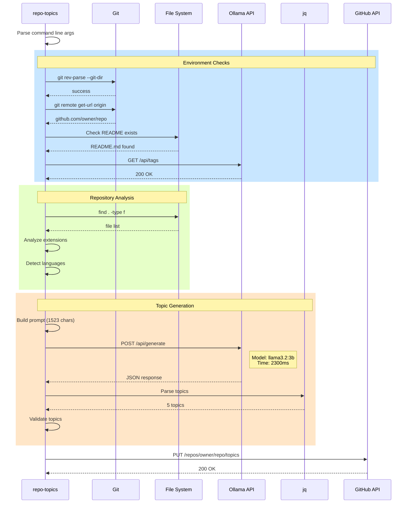

# Debug Monitoring Specification for repo-topics

## Overview
This specification defines the implementation of a `--debug` flag for the `repo-topics` script that will provide comprehensive monitoring, logging, and visualization of the script's execution flow, with particular focus on Ollama API interactions.

## Command Line Interface

```bash
./repo-topics --debug              # Enable debug mode with default settings
./repo-topics --debug --debug-log=debug.log  # Custom log file
./repo-topics --debug --debug-level=2        # Verbose debug (levels: 1=normal, 2=verbose, 3=trace)
```

## Debug Features

### 1. Execution Flow Tracking

**Timestamp Format**: ISO 8601 with milliseconds
```
2025-01-27T10:23:45.123Z
```

**Event Types**:
- `START` - Script initialization
- `CHECK` - Environment verification steps
- `ANALYZE` - Repository analysis phase
- `OLLAMA_REQUEST` - Ollama API call initiated
- `OLLAMA_RESPONSE` - Ollama API response received
- `PARSE` - Response parsing operations
- `VALIDATE` - Topic validation
- `GITHUB_UPDATE` - GitHub API operations
- `END` - Script completion

### 2. Metrics Collection

#### Core Metrics
```scheme
(define debug-metrics
  '((total-execution-time . 0)
    (ollama-calls . 0)
    (ollama-total-time . 0)
    (ollama-retries . 0)
    (parsing-failures . 0)
    (validation-failures . 0)
    (github-api-calls . 0)))
```

#### Per-Ollama-Call Metrics
- Request timestamp
- Request size (bytes)
- Response time (ms)
- Response size (bytes)
- Model used
- Retry attempt number
- Success/failure status
- Error details (if failed)

### 3. Debug Output Structure

```
[2025-01-27T10:23:45.123Z] [START] repo-topics debug mode v1.0
[2025-01-27T10:23:45.124Z] [CHECK] Git repository: ✓
[2025-01-27T10:23:45.125Z] [CHECK] GitHub remote: ✓ (owner/repo)
[2025-01-27T10:23:45.126Z] [CHECK] README found: ✓ (README.md, 2.5KB)
[2025-01-27T10:23:45.127Z] [CHECK] jq available: ✓
[2025-01-27T10:23:45.128Z] [CHECK] Ollama running: ✓
[2025-01-27T10:23:45.129Z] [ANALYZE] File extensions found: .scm(45), .md(12), .sh(8)
[2025-01-27T10:23:45.130Z] [ANALYZE] Languages detected: scheme, shell, markdown
[2025-01-27T10:23:45.131Z] [ANALYZE] Frameworks detected: guile, make
[2025-01-27T10:23:45.200Z] [OLLAMA_REQUEST] Model: llama3.2:3b, Prompt: 1523 chars
[2025-01-27T10:23:47.500Z] [OLLAMA_RESPONSE] Time: 2300ms, Response: 256 chars
[2025-01-27T10:23:47.501Z] [PARSE] Extracted topics: 5
[2025-01-27T10:23:47.502Z] [VALIDATE] Valid topics: 5/5
[2025-01-27T10:23:47.600Z] [GITHUB_UPDATE] Success
[2025-01-27T10:23:47.601Z] [END] Total time: 2456ms, Ollama calls: 1
```

### 4. Log File Format

#### JSON Log Format (for automated processing)
```json
{
  "timestamp": "2025-01-27T10:23:45.123Z",
  "event": "OLLAMA_REQUEST",
  "data": {
    "model": "llama3.2:3b",
    "prompt_size": 1523,
    "request_id": "req-001",
    "retry_attempt": 1
  }
}
```

#### Human-Readable Summary Log
```
=== REPO-TOPICS DEBUG SUMMARY ===
Repository: owner/repo
Start Time: 2025-01-27T10:23:45.123Z
End Time: 2025-01-27T10:23:47.601Z
Total Duration: 2.478s

Environment Checks:
  ✓ Git repository
  ✓ GitHub remote (owner/repo)
  ✓ README.md (2.5KB)
  ✓ jq installed
  ✓ Ollama running

Repository Analysis:
  Languages: scheme (45 files), shell (8 files)
  Frameworks: guile, make
  Total files analyzed: 65

Ollama API Metrics:
  Total calls: 1
  Successful: 1
  Failed: 0
  Retries: 0
  Average response time: 2300ms
  Total Ollama time: 2300ms (93% of total)
  
  Call Details:
    [1] Model: llama3.2:3b
        Time: 2300ms
        Prompt: 1523 chars
        Response: 256 chars
        Topics extracted: 5
        Topics validated: 5

Generated Topics: scheme, guile, functional-programming, cli-tool, github-api

GitHub Update: SUCCESS

Performance Breakdown:
  Environment checks: 5ms (0.2%)
  Repository analysis: 71ms (2.9%)
  Ollama processing: 2300ms (92.8%)
  GitHub update: 100ms (4.0%)
  Other: 2ms (0.1%)
```

### 5. Sequence Diagram Generation

#### Output Format: PlantUML


#### Mermaid Alternative


### 6. Implementation Details

#### Debug Infrastructure
```scheme
;; Debug state management
(define *debug-mode* #f)
(define *debug-level* 1)
(define *debug-log-port* #f)
(define *debug-start-time* 0)
(define *debug-events* '())
(define *debug-metrics* (make-hash-table))

;; Debug logging function
(define (debug-log event-type message . data)
  (when *debug-mode*
    (let ((timestamp (current-time-string))
          (elapsed (- (current-time) *debug-start-time*)))
      (format *debug-log-port* 
              "[~a] [~a] ~a~%"
              timestamp event-type message)
      (when (and data *debug-level* (>= *debug-level* 2))
        (format *debug-log-port* "  Data: ~a~%" data))
      (set! *debug-events* 
            (cons (list timestamp event-type message data elapsed)
                  *debug-events*)))))

;; Metric tracking
(define (track-metric key value)
  (hash-set! *debug-metrics* key 
             (+ value (hash-ref *debug-metrics* key 0))))

;; Ollama call wrapper with metrics
(define (debug-wrapped-ollama-call original-fn request verbose?)
  (let ((start-time (current-time))
        (call-id (format #f "ollama-~a" (+ 1 (hash-ref *debug-metrics* 'ollama-calls 0)))))
    (debug-log 'OLLAMA_REQUEST 
               (format #f "Call ~a to model ~a" 
                       call-id (assoc-ref request 'model))
               `((prompt-size . ,(string-length (assoc-ref request 'prompt)))
                 (model . ,(assoc-ref request 'model))))
    (track-metric 'ollama-calls 1)
    
    (let ((response (original-fn request verbose?)))
      (let ((duration (- (current-time) start-time)))
        (track-metric 'ollama-total-time duration)
        (debug-log 'OLLAMA_RESPONSE
                   (format #f "Call ~a completed in ~ams" call-id duration)
                   `((response-size . ,(if response (string-length response) 0))
                     (success . ,(if response #t #f))))
        response))))
```

#### Summary Generation
```scheme
(define (generate-debug-summary)
  (let ((total-time (- (current-time) *debug-start-time*))
        (ollama-time (hash-ref *debug-metrics* 'ollama-total-time 0))
        (ollama-calls (hash-ref *debug-metrics* 'ollama-calls 0)))
    (format #t "~%=== REPO-TOPICS DEBUG SUMMARY ===~%")
    (format #t "Total Duration: ~as~%" (/ total-time 1000.0))
    (format #t "~%Ollama API Metrics:~%")
    (format #t "  Total calls: ~a~%" ollama-calls)
    (format #t "  Average response time: ~ams~%" 
            (if (> ollama-calls 0)
                (/ ollama-time ollama-calls)
                0))
    (format #t "  Total Ollama time: ~ams (~a% of total)~%"
            ollama-time
            (round (* 100 (/ ollama-time total-time))))
    ;; ... additional summary output
    ))
```

### 7. Usage Examples

```bash
# Basic debug mode
./repo-topics --debug

# Debug with custom log file
./repo-topics --debug --debug-log=analysis.log

# Verbose debug for troubleshooting
./repo-topics --debug --debug-level=3

# Debug with dry-run (no GitHub update)
./repo-topics --debug --dry-run

# Generate sequence diagram only
./repo-topics --debug --sequence-only
```

### 8. Future Enhancements

1. **Real-time Monitoring**: Web UI dashboard for live monitoring
2. **Performance Profiling**: Detailed timing breakdowns for each function
3. **Ollama Request Replay**: Save and replay Ollama requests for testing
4. **Comparative Analysis**: Compare multiple runs to identify performance regressions
5. **Export Formats**: CSV, JSON, and Prometheus metrics export
6. **Integration with Observability Tools**: OpenTelemetry support

## Implementation Priority

1. Basic debug flag and timestamped logging
2. Ollama call tracking and metrics
3. Summary generation
4. Sequence diagram generation
5. Advanced features (replay, export, etc.)