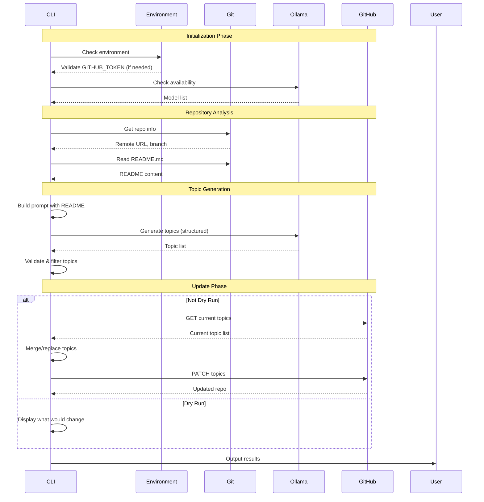

# Repo Topic Generator CLI Specification

## Tool Name: `repo-topics`

A CLI utility that analyzes a git repository and automatically generates/updates GitHub topics using LLM analysis.

## Command Line Interface

```bash
repo-topics [OPTIONS]

OPTIONS:
  --dry-run          Show what topics would be set without updating GitHub
  --json             Output results in JSON format
  --model MODEL      Ollama model to use (default: llama3.2:3b)
  --max-topics N     Maximum topics to generate (default: 10, max: 20)
  --include-current  Merge with existing topics instead of replacing
  --verbose          Show detailed progress
  --help             Show this help message
```

## Environment Contract

### Required Environment
```bash
# For GitHub updates (optional if --dry-run)
GITHUB_TOKEN=ghp_xxxx

# Ollama must be running
ollama list  # Should succeed
```

### Working Directory Requirements
```bash
# Must be in a git repository
git rev-parse --show-toplevel  # Should succeed

# Repository should have a remote
git remote get-url origin  # Should return github.com URL
```

## Operational Spec

```scheme
;; CLI Configuration Spec
(register-spec 'cli-config
  '((dry-run . boolean)
    (json-output . boolean)
    (model . string)
    (max-topics . (integer-range 1 20))
    (include-current . boolean)
    (verbose . boolean)))

;; Environment Validation Spec
(register-spec 'environment
  '((github-token . (optional string))  ; Required unless dry-run
    (ollama-available . boolean)        ; Required always
    (git-repo . boolean)                ; Required always
    (github-remote . (optional string)) ; Required unless dry-run
    (readme-exists . boolean)))         ; Required always

;; Execution Context Spec
(register-spec 'execution-context
  '((repo-name . string)
    (repo-owner . string)
    (readme-content . string)
    (current-topics . (array string))
    (visibility . (enum "public" "private"))))

;; Output Spec
(register-spec 'cli-output
  '((success . boolean)
    (repo . string)
    (current-topics . (array string))
    (generated-topics . (array string))
    (final-topics . (array string))
    (updated . boolean)
    (error . (optional string))))
```

## Execution Flow



## Tool Calling Spec (Future Enhancement)

```scheme
;; Tool definitions for Ollama
(register-spec 'tool-list-files
  '((name . "list_files")
    (description . "List files in the repository")
    (parameters . (object
                   (path . (optional string))
                   (pattern . (optional string))))
    (returns . (array string))))

(register-spec 'tool-read-file
  '((name . "read_file")
    (description . "Read contents of a file")
    (parameters . (object
                   (path . string)))
    (returns . string)))

;; Tool calling flow
(register-spec 'tool-calling-request
  '((model . string)
    (messages . (array (object
                       (role . (enum "system" "user" "assistant"))
                       (content . string))))
    (tools . (array (union tool-list-files tool-read-file)))
    (format . (object
              (type . "object")
              (properties . (object
                            (topics . (object
                                      (type . "array")
                                      (items . (object
                                               (type . "string")))))))))))
```

## Implementation Stages

### Stage 1: Basic Implementation (Current)
- Read README.md only
- Single Ollama call with structured output
- Simple topic validation
- Basic GitHub update

### Stage 2: Enhanced Analysis
- Read multiple files (package.json, Cargo.toml, etc.)
- Analyze code structure
- Consider existing topics
- Smarter topic suggestions

### Stage 3: Tool Calling
- Let Ollama explore the repository
- Dynamic file discovery
- Multi-turn conversation
- Contextual understanding

## Error Handling

```scheme
(register-spec 'error-types
  '((type . (enum "environment" "git" "ollama" "github" "validation"))
    (message . string)
    (details . (optional object))
    (recoverable . boolean)))
```

### Error Scenarios
1. **No README**: Try README.rst, readme.md, etc.
2. **Ollama Down**: Clear error message with fix
3. **No GitHub Token**: Allow dry-run only
4. **Rate Limited**: Show reset time
5. **Invalid Topics**: Filter and warn

## Example Usage

```bash
# Basic usage (analyze current repo)
$ repo-topics
✓ Analyzing repository: awesome-project
✓ Current topics: api, validation
✓ Generated topics: scheme, validation, llm, github-api, workflow
✓ Updated repository with 5 topics

# Dry run with JSON output
$ repo-topics --dry-run --json
{
  "success": true,
  "repo": "user/awesome-project",
  "current_topics": ["api", "validation"],
  "generated_topics": ["scheme", "validation", "llm", "github-api"],
  "final_topics": ["scheme", "validation", "llm", "github-api"],
  "updated": false
}

# Verbose mode
$ repo-topics --verbose --dry-run
[INFO] Checking environment...
[INFO] Ollama model: llama3.2:3b
[INFO] Repository: user/awesome-project
[INFO] Reading README.md (15.2 KB)
[INFO] Generating topics with Ollama...
[INFO] Generated 8 topics, filtered to 5
[INFO] Would update: api, validation → scheme, validation, llm, github-api, workflow
```

## Configuration File (Future)

```yaml
# .repo-topics.yml
model: llama3.2:3b
max_topics: 15
include_patterns:
  - "*.md"
  - "src/**/*.scm"
exclude_patterns:
  - "test/**"
custom_prompt: |
  Focus on technical topics that describe
  the implementation technology and purpose.
```